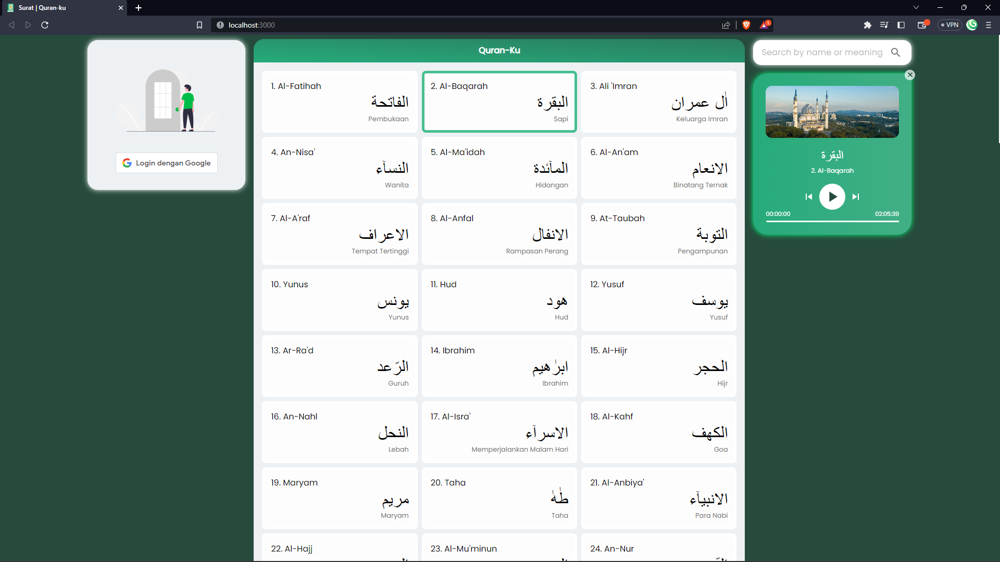

# Quran-Ku

Quran-ku is a website designed to facilitate users in listening to the verses of the Quran. The website provides various features that allow users to easily select and listen to the Quranic verses.

One of the main features of Quran-ku website is its ability to directly play the verses of the Quran. Users can choose the surah they want to listen to through an intuitive interface and then enjoy the recitation of the sacred verses with clear audio quality.

The website also provides comprehensive information about each surah of the Quran, including the surah name, number of verses, etc. Users can explore this information to enhance their understanding of the Quran.

Additionally, Quran-ku offers a bookmark feature that allows users to mark their favorite or memorable surahs. Users can easily access the bookmarked surahs through the bookmark menu.

The website has a simple and user-friendly interface, making it suitable for users of all levels, whether beginners or experienced in studying the Quran. With Quran-ku, users can comfortably listen to and explore the beauty of the sacred verses of the Quran anytime and anywhere.

With the presence of Quran-ku website, listening to the verses of the Quran becomes more practical and enjoyable, helping users deepen their spiritual connection with the Quran.

# Demo

[https://quran-ku-eosin.vercel.app/](https://quran-ku-eosin.vercel.app/)

# Feature List

- [x] List Surah of Al-Qur'an
- [ ] Detail Surah with interpretation
- [x] Search surah by name or meaning
- [x] Play Audio Full Surah
- [ ] Play Audio by paragraph of surah
- [x] Login with Google
- [ ] Bookmark
- [ ] Support tablet and mobile view (Responsive)

# APIs used

- [equran.id](https://equran.id/apidev)
